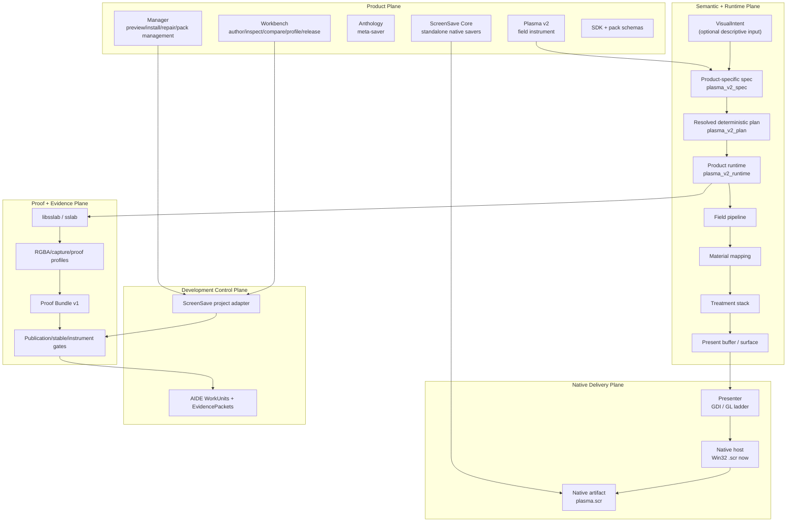
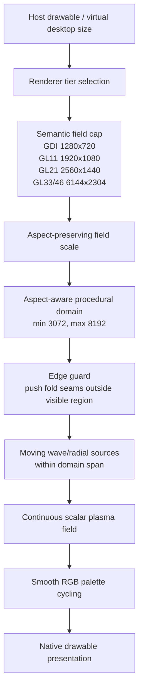
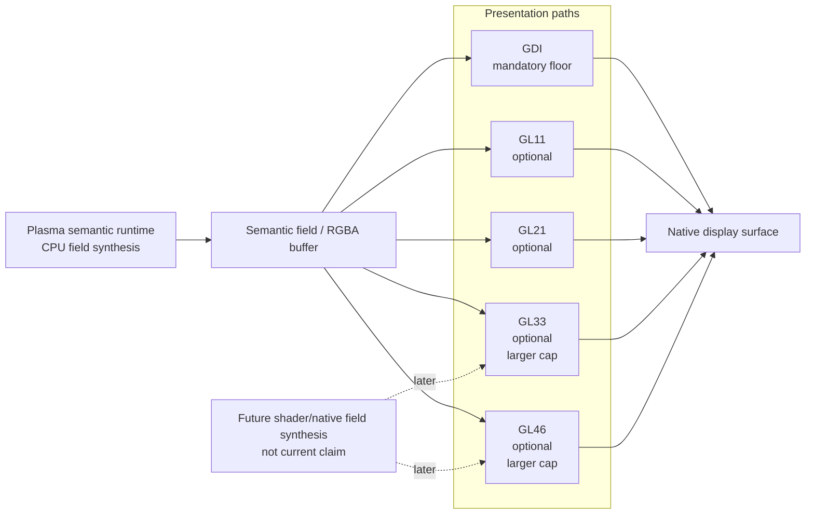
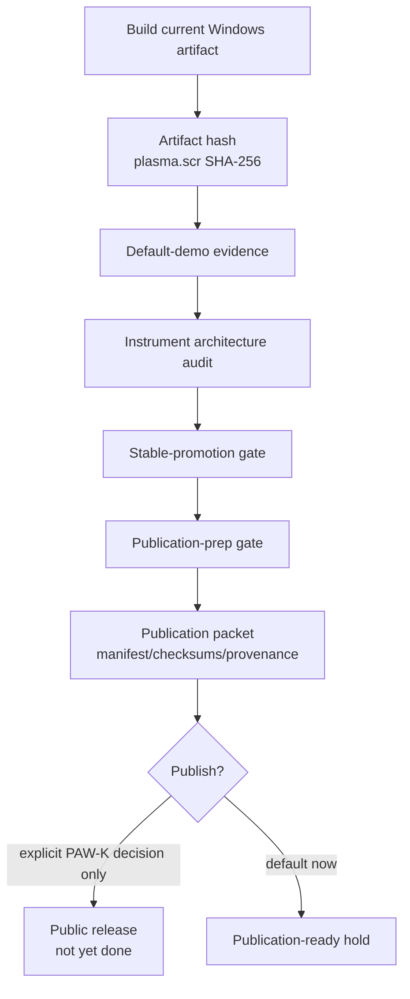
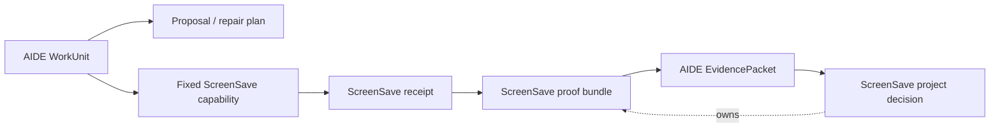
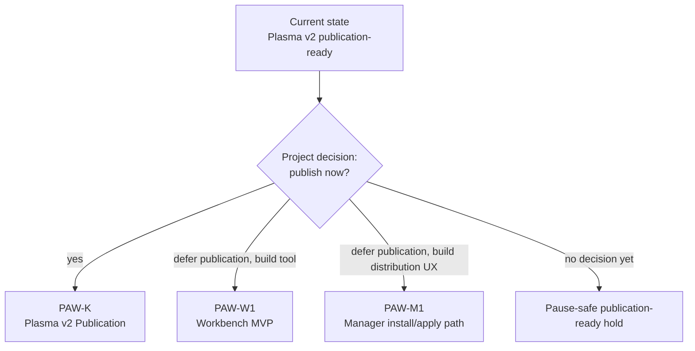

# ScreenSave Plasma Report Inventory - 2026-06-29

Status: architecture/report inventory, not normative contract law.

Source input:

- Attachment: `C:/Users/Jules/.codex/attachments/67b8ecd2-8f55-42e3-91aa-27861205ce10/pasted-text.txt`
- Referenced report baseline: `f6d1101a585777726e4bd4d6072f5e6d6242e84c`
- Current repo head while recording this inventory: `85643be692a567f980cca1b88bd548bc30980ae8`

The pasted report inventory repeats the core ScreenSave doctrine:

```text
Portable meaning. Native delivery. Deterministic proof. Optional automation.
```

It also preserves the central product boundary:

```text
ScreenSave owns art, runtime, artifacts, compatibility, and proof.
AIDE remains an optional development and evidence control plane.
```

## Current Headline State

Live project-state validation still reports:

```text
Plasma v2: publication-ready
stable: true
release_promotion: accepted
publication_prep: ready
publication: not-published
opened_next: plasma-v2-publication
```

The current tracked Plasma artifact identity remains:

```text
out/msvc/vs2017_xp/Release/plasma/plasma.scr
SHA256: d4e58fd8ed10d67704c7cb58205f27d61fb5c10ded3c1b904abddf414ac25d41
```

This is publication-ready evidence, not public publication. No public release
upload, GitHub release creation, release-page publication, public download-link
verification, broad compatibility certification, public SDK freeze, all-saver
migration, Manager install/apply mutation, graphical Workbench MVP, platform
expansion, or AIDE runtime authority is included.

## Report Inventory

| Report or surface | Plain-English purpose | Current meaning |
| --- | --- | --- |
| `PROJECT_STATE.toml` | Canonical machine-readable repo truth. | Records Plasma v2 as publication-ready, stable, accepted, and not published. |
| `validation/captures/plasma-v2/default-demo/default-demo-report.json` | Proves the current high-resolution default Plasma posture. | Validates `plasma_lava`, adaptive high-resolution field caps, renderer ladder exposure, GDI floor, GL optionality, display-refresh pacing, and artifact hash. |
| Plasma artifact identity | Names the exact `.scr` binary under discussion. | Current artifact hash is `d4e58fd8ed10d67704c7cb58205f27d61fb5c10ded3c1b904abddf414ac25d41`. |
| High-resolution implementation evidence | Describes the source-level default-demo upgrade. | Renderer-tier caps are GDI `1280x720`, GL11 `1920x1080`, GL21 `2560x1440`, and GL33/GL46 `6144x2304`, with larger procedural domain and edge guard. |
| Instrument architecture audit | Checks whether Plasma is a direct-control deterministic field instrument. | Latest gate set reports promotion-ready; Plasma is not treated as a preset picker. |
| `validation/captures/plasma-v2/stable-promotion/gate-report.json` | Checks stable-promotion eligibility. | Stable promotion is accepted and recorded as `stable = true`. |
| `validation/captures/plasma-v2/publication-prep/gate-report.json` | Checks whether the release packet is ready for a future publication decision. | Publication prep is ready, but public upload and release-page publication are false. |
| `releases/plasma-v2-stable/release-manifest.toml` | Top-level local publication-prep packet. | Lists artifacts, checksums, provenance, support wording, known limits, and evidence references without publishing. |
| `releases/plasma-v2-stable/artifact-manifest.toml` | Names the unpublished prep artifacts. | Includes the Plasma `.scr`, example data pack, proof bundle, and release manifest; `published` entries remain false. |
| `releases/plasma-v2-stable/checksums.sha256` | Verifies release-prep checksum integrity. | Publication-prep gate reports parseable matching checksums. |
| Release provenance/security/support reports | Record origin, security boundary, and support claims. | Current reports preserve artifact-specific, evidence-classed support and avoid broad certification. |
| Final artistic decision | Project-owned visual acceptance. | Current state records `accepted-for-stable`; validators and AIDE do not replace this verdict. |
| Proof Bundle v1 | Structured ScreenSave proof object. | Connects product/profile/artifact, source state, proof profile, captures, lifecycle/performance facts, and claim boundaries. |
| AIDE evidence index and publication summary | AIDE's evidence records. | AIDE records evidence only; it does not publish, certify compatibility, promote release, or become runtime dependency. |
| Workbench report | Current Workbench truth. | Workbench is a proof cockpit/model shell, not the full graphical creative app. |
| `docs/roadmap/break-handoff-2026-06-28.md` | Pause-safe handoff before the high-resolution refresh. | Boundary remains useful, but its recorded HEAD predates the latest high-resolution refresh and subsequent docs commits. |

## Plain-English Architecture

ScreenSave is now best understood as:

```text
Product-owned native savers
+ portable deterministic semantics
+ thin native delivery
+ shared proof infrastructure
+ optional Manager, Workbench, and AIDE support surfaces
```

Plasma is now best understood as:

```text
Config / Preset / Pack / VisualIntent
-> plasma_v2_spec
-> plasma_v2_plan
-> plasma_v2_runtime
-> field sources and generators
-> field modifiers
-> output transform
-> material response
-> treatment
-> presentation
-> GDI floor or optional GL renderer
-> proof and publication gates
```

The source text's most important boundary remains:

```text
Share mechanics.
Preserve meaning.
```

Shared platform code may handle timing, rendering surfaces, proof, packs,
hosts, and evidence. Product semantics stay product-owned. Plasma must not
become a universal base class for every saver.

## Diagram Inventory

The pasted text references a rendered contact sheet and individual PNG exports
from sandbox paths. Those rendered PNGs are external artifacts and were not
imported into the repo. The durable repo-local representation below is the
Mermaid source.

### 1. ScreenSave System Architecture



### 2. Plasma v2 Field-Instrument Pipeline

```mermaid
flowchart LR
    Input["Config / Preset / Pack / VisualIntent"]
    Spec["plasma_v2_spec\nsemantic user intent"]
    Plan["plasma_v2_plan\nresolved executable truth"]
    Runtime["plasma_v2_runtime\nstate + buffers"]
    Sources["Sources\nphase, seed, coords"]
    Generators["Field generators\nclassic / radial / noise"]
    Modifiers["Modifiers\nwarp / feedback / morph"]
    Output["Output transform\ncontinuous raster"]
    Material["Material response\nfield to color"]
    Treatment["Treatment\nsoft / phosphor / restrained CRT"]
    Presentation["Presentation\nflat RGBA/native drawable"]
    Renderer["Renderer/Presenter\nGDI floor, GL optional"]

    Input --> Spec --> Plan --> Runtime --> Sources --> Generators --> Modifiers --> Output --> Material --> Treatment --> Presentation --> Renderer
```



### 3. High-Resolution Default-Demo Architecture



### 4. Runtime/Render/Presenter Split



### 5. Proof And Publication Gates



### 6. AIDE Evidence/Control-Plane Boundary



### 7. Next Decision Tree



## Next Decision

The repo is still paused at the same product decision:

```text
Plasma v2 publication-ready
-> publish through PAW-K
   or defer publication and choose PAW-W1 Workbench MVP
   or defer publication and choose PAW-M1 Manager install/apply
```

Default posture remains a publication-ready hold until the project owner makes
an explicit decision.
